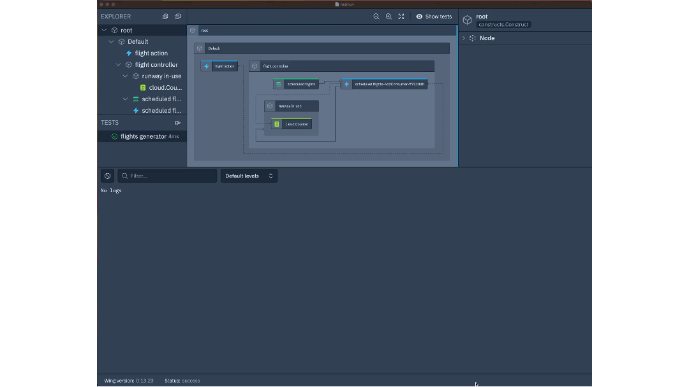

## What is it?
FlightController orchestrates task execution (flight traffic) in a controlled manner within cloud environments. It takes user-defined tasks (flights to take off/landing traffic etc.) and sends for executions (let flights to take off/landing) whenever the specified concurrency limit (runway limit) permits. It can be helpful to perform a full scan of a NoSQL database table at a designated throughput, enabling offline jobs to be completed with calculated impact. For example, it can be used to calculate an e-commerce site’s daily SKUs’ popularity rate based on today’s view impressions and their past 3-day popularity rate, or dump weekly snapshots to the data lake with on-the-fly data transformation.
## Implementation Notes
FlightController uses a user-defined inflight function to handle each received task. Users push tasks to a FlightController-hosted queue, which FlightController then polls periodically (based on a user-defined interval) when the counting semaphore indicates that task executors are available (according to user-defined max throughput).

## Team
@flyingImer

## Demo

## Issues
- [#2161](https://github.com/winglang/wing/issues/2161) - 🆕 Compiler crashes on function type in struct
- [#390](https://github.com/winglang/wing/issues/390) - Function Declaration: call inflight closure from inflight code
- [#2217](https://github.com/winglang/wing/issues/2217) - 🆕 Permission binding does not work within Struct
- [#1966](https://github.com/winglang/wing/issues/1966) - Reference to `this` is unknown inside cloud.Api method definition
